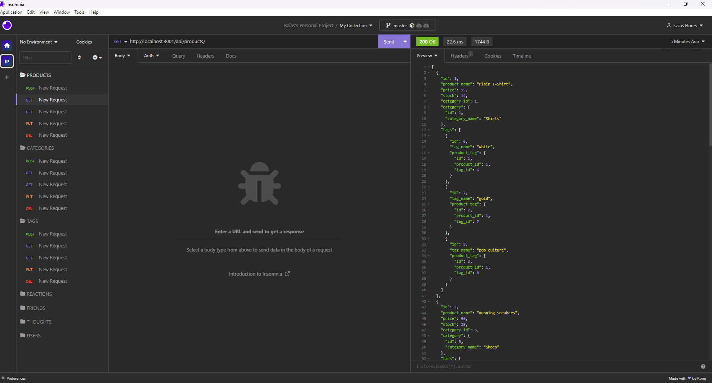

# E-Commerce_Backend
  ## Licence:
  

  ## Description
 Internet retail, also known as e-commerce, is the largest sector of the electronics industry, generating an estimated $29 trillion in 2019. E-commerce platforms like Shopify and WooCommerce provide a suite of services to businesses of all sizes. Due to their prevalence, understanding the fundamental architecture of these platforms is benefitial for a full-stack web developer.

The task is to build the back end for an e-commerce site by modifying starter code; configure a working Express.js API to use Sequelize to interact with a MySQL database.

## User Story

```md
AS A manager at an internet retail company
I WANT a back end for my e-commerce website that uses the latest technologies
SO THAT my company can compete with other e-commerce companies
```

## Acceptance Criteria

```md
GIVEN a functional Express.js API
WHEN I add my database name, MySQL username, and MySQL password to an environment variable file
THEN I am able to connect to a database using Sequelize
WHEN I enter schema and seed commands
THEN a development database is created and is seeded with test data
WHEN I enter the command to invoke the application
THEN my server is started and the Sequelize models are synced to the MySQL database
WHEN I open API GET routes in Insomnia for categories, products, or tags
THEN the data for each of these routes is displayed in a formatted JSON
WHEN I test API POST, PUT, and DELETE routes in Insomnia
THEN I am able to successfully create, update, and delete data in my database
```
  ## Table of Contents
  - [Installation](#installation)
  - [Usage](#usage)
  - [Credits](#credits)

  ## Installation
  This is a screenshot of the application being tested:


  - This is the link to the video:
  https://drive.google.com/file/d/1IvfUz3PMVsS-lsl947Dkd52C2t88Xt6w/view
  

  ## Usage
  - You can run it locally by cloning the repo.
  - You need to run the code npm start in your terminal.
  - Finally, you can use any open-source tool used for testing and debugging HTTP APIs. 

  ## Credits
  N/A
